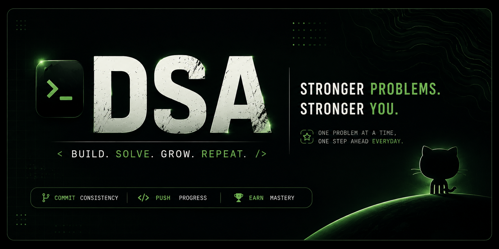

# Welcome to my Data Structures & Algorithms repository!  
This repo contains my solutions to various DSA problems, mainly focused on **Java**, along with clean code, patterns, and learning notes.

---


---

## 📌 About This Repository

This repository is created to:
- Strengthen my problem-solving skills
- Practice common DSA patterns
- Prepare for coding interviews
- Maintain structured notes for revision

---

## 🧠 Topics Covered

- Arrays
- Strings
- Hashing

---

## 🛠️ Language Used

- Java ☕
- C 🦀

---

## 📂 Structure

```text
DSA
├── Array&hashing
│   ├── Anagram.java
│   ├── Duplicate.java
│   └── Solution.java
├── DailyStreak
│   ├── DailyStreak1.java
│   └── DailyStreak2.java
|   └──DailyStreak3.c
│   └── DailyStreak4.java
├── .gitignore
└── README.md
```
